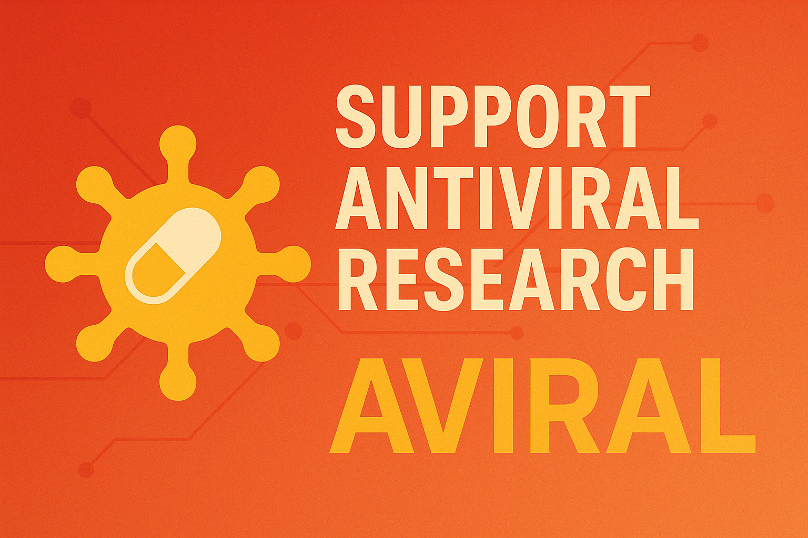
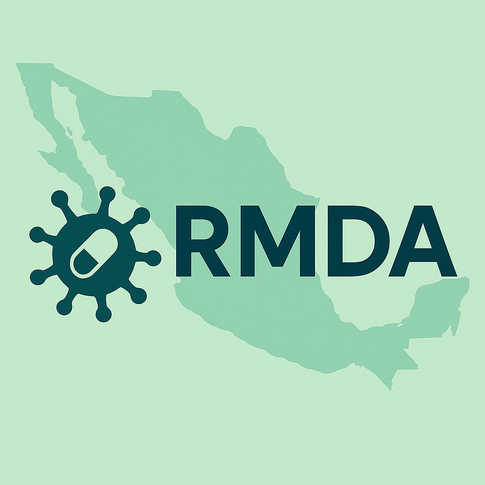

# 🧬 AVIRAL Token

**ES | Apoya el desarrollo de antivirales desde tu navegador.**  
**EN | Support antiviral research with decentralized mining.**

---

## 🇲🇽 ¿Qué es AVIRAL?

**AVIRAL** es un token comunitario impulsado por la **Red Mexicana para el Desarrollo de Antivirales (RMDA)**.  
Su propósito es financiar investigaciones sobre antivirales para virus emergentes como Dengue, Zika, SARS-CoV-2 y otros.

---

## 💻 ¿Cómo puedes ayudar?

🧠 **Solo deja esta página abierta.** Estás donando poder de cómputo que se utiliza para minar **MintMe Coin**.  
💰 Estos fondos se usan para **lanzar oficialmente el token AVIRAL** en la blockchain y hacerlo intercambiable globalmente.  
🧪 ¡Tu navegador puede ayudar a financiar ciencia real!

> 💬 *“Un clic hoy puede significar una cura mañana.”*

---

## 🌐 What is AVIRAL?

AVIRAL is a blockchain-based community token that supports real antiviral research in Mexico through decentralized funding.

By simply leaving [this page](https://osram90.github.io/aviraltoken.github.io/) open, you're helping us mine MintMe Coin, which is used to activate the AVIRAL token on the blockchain.

---

## 🛒 Compra o consulta el token

👉 [Comprar o ver AVIRAL en MintMe](https://www.mintme.com/token/AVIRAL)

---

## ✨ Powered by

**RMDA** – Red Mexicana para el Desarrollo de Antivirales  
Universidad Autónoma de Sinaloa (UAS) · IMSS · UAM · CINVESTAV · +Colaboradores

> _“Ciencia abierta, descentralizada y urgente.”_
